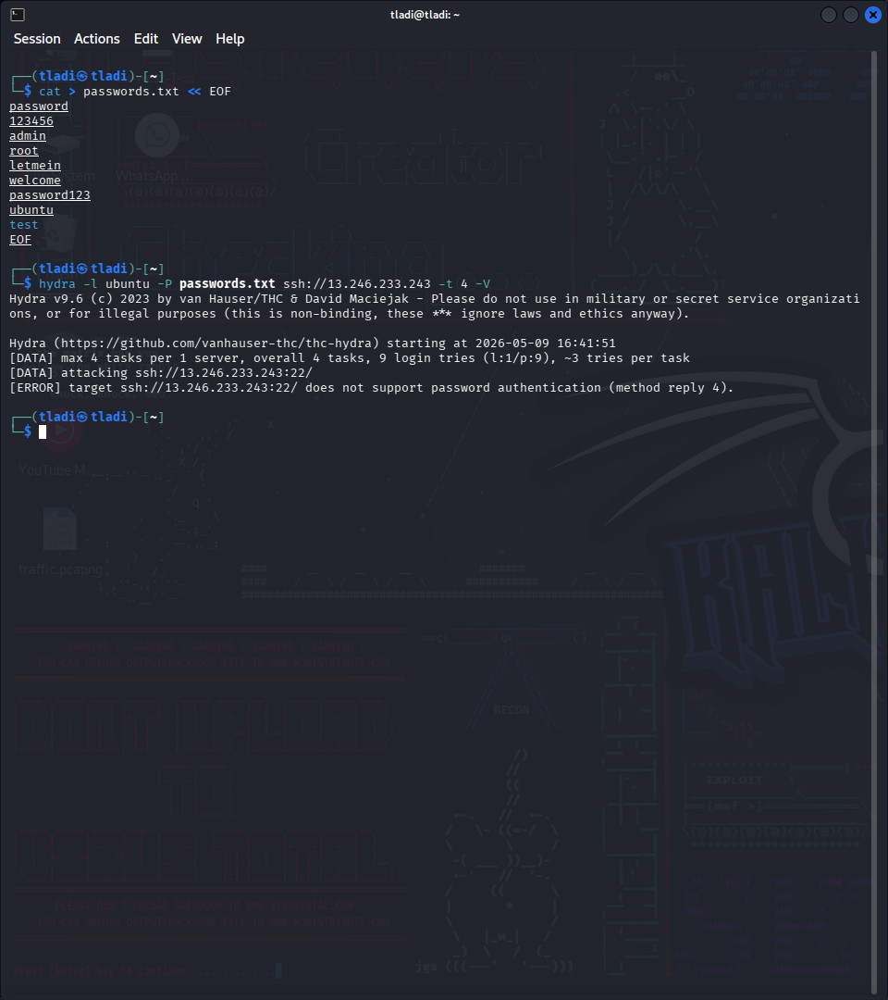
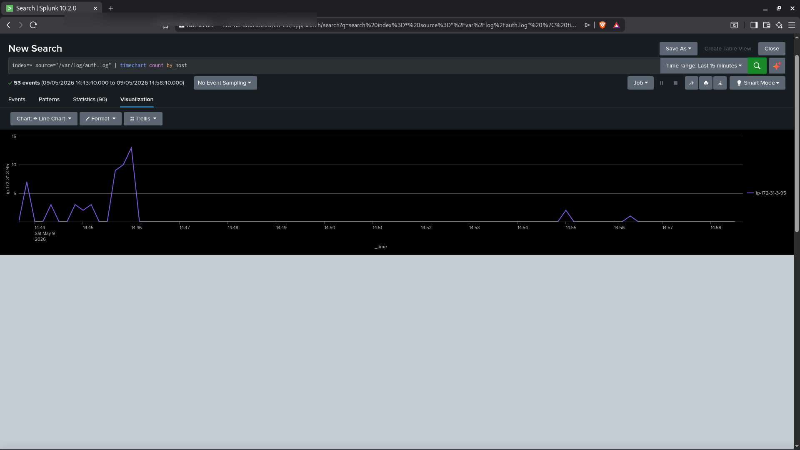
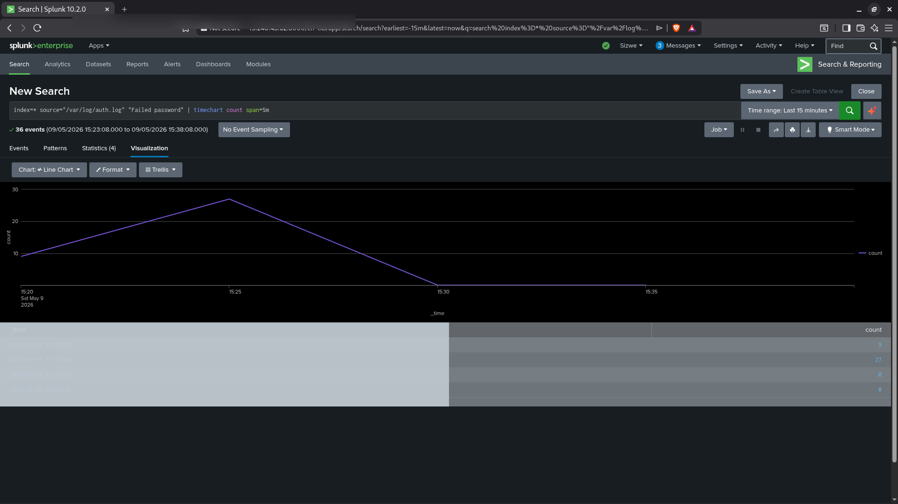
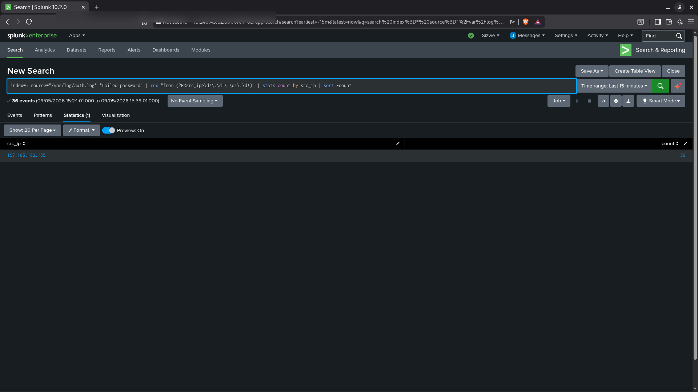
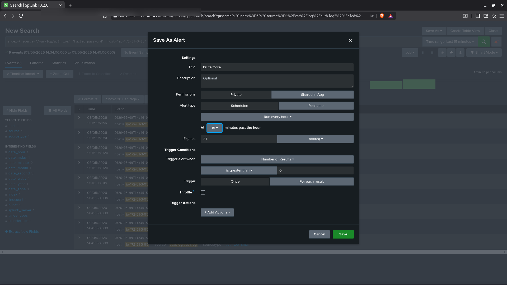

# Project 01 - SSH Brute Force Detection


---

## Overview

In this project I simulated an SSH brute force attack from a Kali Linux machine against an Ubuntu 24.04 victim running on AWS EC2. I then ingested the victim's authentication logs into Splunk Enterprise and built a detection rule that identifies brute force activity by counting failed login attempts per source IP.

This is one of the most common attack vectors in the wild and a critical detection capability for any SOC analyst.

---

## MITRE ATT&CK Mapping

| Field | Value |
|-------|-------|
| Tactic | Credential Access |
| Technique | Brute Force: Password Guessing |
| ID | T1110.001 |
| Data Source | Authentication logs (/var/log/auth.log) |

---

## Lab Environment

| Component | Details |
|-----------|---------|
| SIEM | Splunk Enterprise 10.2.0 |
| Victim OS | Ubuntu 24.04 (AWS EC2, af-south-1) |
| Victim IP | 13.246.220.248 |
| Attacker | Kali Linux |
| Attacker Tool | Hydra 9.x |
| Log Source | /var/log/auth.log |
| Forwarder | Splunk Universal Forwarder |

---

## Attack Simulation

I ran Hydra from the Kali machine against the victim's SSH service on port 22. I used a wordlist file (password.txt) containing common passwords to simulate a credential stuffing attack.

**Hydra command used:**

```bash
hydra -l ubuntu -P /home/tladi/password.txt ssh://13.246.220.248 -t 4 -f -V
```

**Flags explained:**

| Flag | Meaning |
|------|---------|
| -l ubuntu | Target username |
| -P password.txt | Password wordlist |
| ssh:// | Protocol |
| -t 4 | 4 parallel threads |
| -f | Stop after first valid login found |
| -V | Verbose output |

Hydra generated a burst of failed SSH authentication attempts in a very short time window. The victim's auth.log recorded every attempt with the source IP and timestamp.

---

## Log Evidence

Each failed SSH login attempt generates an entry like this in /var/log/auth.log:

```
May  9 14:46:02 ip-172-31-3-95 sshd[12453]: Failed password for ubuntu from 197.185.162.135 port 54231 ssh2
May  9 14:46:03 ip-172-31-3-95 sshd[12454]: Failed password for ubuntu from 197.185.162.135 port 54232 ssh2
May  9 14:46:04 ip-172-31-3-95 sshd[12455]: Failed password for ubuntu from 197.185.162.135 port 54233 ssh2
```

The Splunk Universal Forwarder shipped these logs to the Splunk indexer in near real-time.

---

## Splunk Detection

### Search Query

I ran the following SPL query in Splunk to identify the attacking IP and count the failed attempts:

```spl
index=* source="/var/log/auth.log" "Failed password"
| rex "from (?P<src_ip>\d+\.\d+\.\d+\.\d+)"
| stats count by src_ip
| sort -count
```

### Results

| src_ip | count |
|--------|-------|
| 197.185.162.135 | 36 |

**36 failed login attempts** were detected from a single source IP within a 15-minute window. This is a clear brute force pattern.

### Timechart Visualization

I also ran a timechart to visualize the spike in authentication events:

```spl
index=* source="/var/log/auth.log"
| timechart count by host
```

The chart showed a sharp spike in events between 14:44 and 14:46 on 09/05/2026, directly corresponding to the Hydra attack window.

---

## Alert Configuration

I saved the detection as a Splunk alert with the following configuration:

| Setting | Value |
|---------|-------|
| Alert Name | brute force |
| Alert Type | Scheduled |
| Run Frequency | Every hour |
| Trigger Condition | Number of results is greater than 0 |
| Trigger | For each result |
| Expires | 24 hours |

---

## Response Actions

If this alert fires in a real environment, the recommended response steps are:

1. Identify the source IP and cross-reference with threat intelligence feeds (AbuseIPDB, VirusTotal).
2. Block the source IP at the security group or firewall level immediately.
3. Check if any successful login occurred from the same IP (`"Accepted password"` or `"Accepted publickey"`).
4. Review the targeted account for any unauthorized activity.
5. Escalate to Tier 2 if successful authentication is confirmed.
6. Document the incident and update the detection threshold if needed.

---

## Key Takeaways

- SSH brute force generates a high volume of `Failed password` entries in auth.log in a short time window.
- The source IP remains consistent across all attempts, making regex extraction an effective enrichment technique.
- Splunk's `stats count by src_ip` and `sort -count` pipeline quickly surfaces the top offenders.
- A threshold of more than 10 failed attempts from one IP within 15 minutes is a reasonable alert trigger for most environments.

---

## Screenshots

### 1. Hydra Running on Kali - Live Brute Force Attack

Hydra attempting SSH credentials against the victim machine. Each line represents one failed password attempt cycling through the wordlist.



---

### 2. Splunk Auth Log Timechart - All Events by Host

Splunk timechart of the full auth.log stream broken down by host. The spike at 14:46 on ip-172-31-3-95 confirms the victim machine received a burst of authentication traffic matching the exact Hydra attack window.



---

### 3. Splunk Timechart - Failed Login Spike

The line chart shows failed logins peaking at 27 attempts in a single 5-minute bucket at 15:25 on 09/05/2026, the exact window Hydra was active.



---

### 4. Splunk Stats - 36 Failed Logins Attributed to Attacker IP

The SPL query `stats count by src_ip` returned one result: 197.185.162.135 with a total of 36 failed login attempts confirmed.



---

### 5. Splunk Save As Alert - Brute Force Alert Configured

The detection was saved as a scheduled Splunk alert to fire every hour when failed login counts exceed the threshold.



---

## Files

- [../../detection-rules/brute-force-alert.spl](../../detection-rules/brute-force-alert.spl) - Full Splunk detection rule
- [../../scripts/brute-force-simulation.sh](../../scripts/brute-force-simulation.sh) - Hydra simulation script
