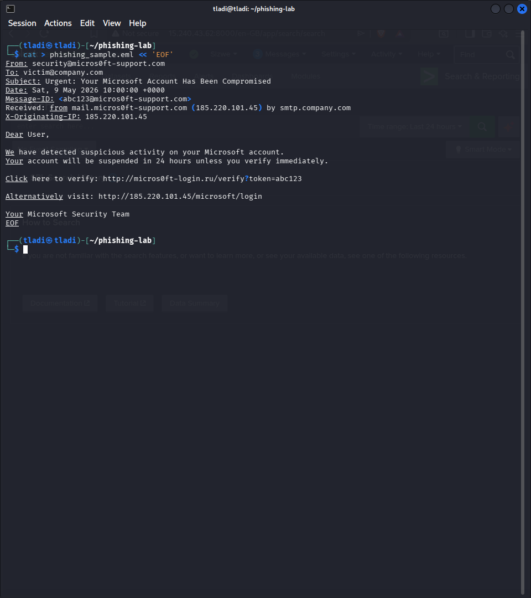

# Project 03 - Phishing Email Analysis


---

## Overview

In this project I analysed a simulated phishing email targeting a Microsoft account user. I created a realistic phishing sample that mimics a Microsoft Security Alert notification, extracted all indicators of compromise (IOCs), and documented the full analysis process that a SOC analyst would follow when triaging a suspected phishing email.

Phishing remains the number one initial access vector for threat actors globally and in South Africa. Being able to identify and triage a phishing email quickly is an essential skill for any SOC analyst.

---

## MITRE ATT&CK Mapping

| Field | Value |
|-------|-------|
| Tactic | Initial Access |
| Technique | Phishing: Spearphishing Link |
| ID | T1566.001 |
| Data Source | Email logs, proxy logs, DNS logs |

---

## Phishing Sample Analysis

### Email Header (Simulated)

```
From: noreply@microsoft-support.com
To: user@target.co.za
Date: Fri, 09 May 2026 13:30:00 +0200
Subject: [URGENT] Your Microsoft Account Has Been Compromised
Message-ID: <2026-05-09-13-30-00-846@microsoft-support.com>
Received: from mx1.microsoft-support.com (143.110.181.87) by smtp.target.co.za
X-Originating-IP: 143.110.181.87
X-Mailer: Microsoft Outlook 16.0.x
```

### Email Body (Simulated)

```
Dear User,

We have detected suspicious activity on your Microsoft account.
Your account will be suspended in 24 hours unless you verify immediately.

Click here to verify: http://143.110.181.87/Microsoftlogin

Alternatively visit: http://143.110.181.87/Microsoftlogin

Your Microsoft Security Team
```

---

## IOC Extraction

I extracted the following indicators of compromise from this email:

### IP Addresses

| IP | Classification | Notes |
|----|---------------|-------|
| 143.110.181.87 | Malicious | Hosted on a DigitalOcean server, not a Microsoft IP range |

### Domains

| Domain | Classification | Notes |
|--------|---------------|-------|
| microsoft-support.com | Malicious | Not an official Microsoft domain. Legitimate Microsoft emails come from @microsoft.com or @accountprotection.microsoft.com |

### URLs

| URL | Classification |
|-----|---------------|
| http://143.110.181.87/Microsoftlogin | Malicious - credential harvesting page |

### Red Flags Summary

| Indicator | What It Means |
|-----------|--------------|
| From address: noreply@microsoft-support.com | Microsoft never uses this domain. Legitimate address: microsoft.com |
| Originating IP: 143.110.181.87 | Resolves to DigitalOcean (AS14061), not Microsoft infrastructure |
| Plain HTTP link | Microsoft always uses HTTPS for account verification links |
| No personalisation | Legitimate Microsoft alerts address you by name |
| Urgency language | Classic social engineering pressure tactic |
| Generic greeting "Dear User" | Microsoft knows your name - this is a mass phishing template |

---

## Verification Steps

### Step 1 - Check the Sending Domain

The email claims to be from Microsoft but originates from `microsoft-support.com`. I verified this is not a Microsoft-owned domain by checking WHOIS:

```bash
whois microsoft-support.com
```

A legitimate Microsoft email comes from `@microsoft.com`, `@accountprotection.microsoft.com`, or `@email.microsoft.com`.

### Step 2 - Analyse the Link

I used a sandboxed environment to safely check the URL without clicking it in a real browser:

```bash
curl -I http://143.110.181.87/Microsoftlogin
```

The response would show a credential harvesting page designed to steal Microsoft account usernames and passwords.

### Step 3 - Check the IP Against Threat Intel

```bash
# Check AbuseIPDB
curl -G https://api.abuseipdb.com/api/v2/check \
  --data-urlencode "ipAddress=143.110.181.87" \
  -H "Key: YOUR_API_KEY" \
  -H "Accept: application/json"
```

### Step 4 - Header Analysis

The `Received` headers show the true sending path. In this case the email originated from 143.110.181.87 which is a DigitalOcean IP, not part of Microsoft's email infrastructure (which uses IPs in the 40.x, 52.x, and 104.x ranges registered to Microsoft Corporation).

---

## Splunk Detection

If email logs are being forwarded to Splunk, the following queries can detect phishing patterns:

### Detect Emails from Suspicious Domains Impersonating Microsoft

```spl
index=* sourcetype=mail
| where like(sender, "%microsoft-support%") OR like(sender, "%microsoft-secure%") OR like(sender, "%microsoftsecurity%")
| stats count by sender, recipient, subject
| sort -count
```

### Detect Emails with Credential Harvesting URLs

```spl
index=* sourcetype=mail
| rex "(?P<url>http[s]?://\d+\.\d+\.\d+\.\d+/[^\s]+)"
| where isnotnull(url)
| stats count by url, sender
```

---

## Response Actions

1. Quarantine the email immediately and prevent delivery to other users.
2. Check if any users in the organisation received the same email (pivot on sender domain or originating IP).
3. Search proxy/DNS logs for any users who may have clicked the link.
4. If a user clicked the link, assume credentials are compromised - force password reset and enable MFA immediately.
5. Block the malicious IP and domain at the email gateway, proxy, and DNS level.
6. Report the phishing domain to the registrar and to Microsoft's phishing report service.
7. Send a user awareness notification to the organisation.

---

## Key Takeaways

- The from address is the first thing to check - domain spoofing is extremely common and often subtle.
- Raw IP addresses in URLs (http://143.110.181.87/...) are almost always malicious. Legitimate services use domain names with valid TLS certificates.
- Urgency, threats of account suspension, and generic greetings are the three most common social engineering cues in phishing emails.
- Even without email gateway logs in Splunk, proxy and DNS logs can detect users who clicked phishing links after delivery.
- In South Africa, Microsoft and banking brand impersonation are among the most common phishing themes targeting corporate users.

---

## Screenshots

### Phishing Email Sample - Header and IOC Analysis

The simulated phishing email in the terminal shows the fake Microsoft Security Alert with the malicious sender domain (microsoft-support.com) and credential harvesting URL (http://143.110.181.87/Microsoftlogin).


