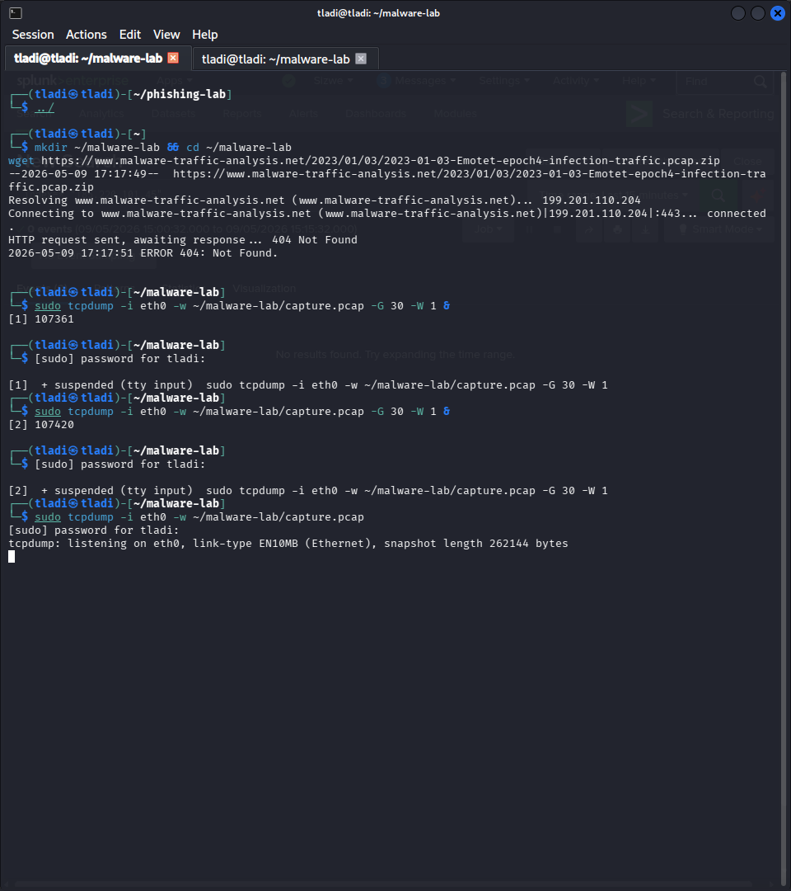
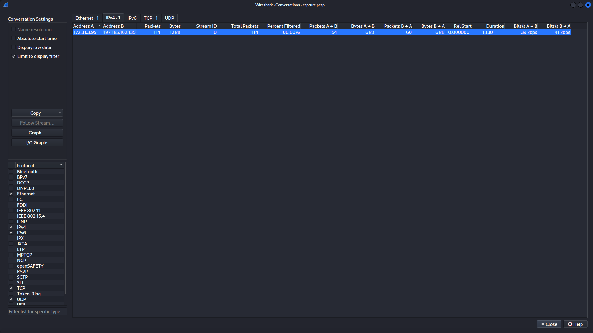
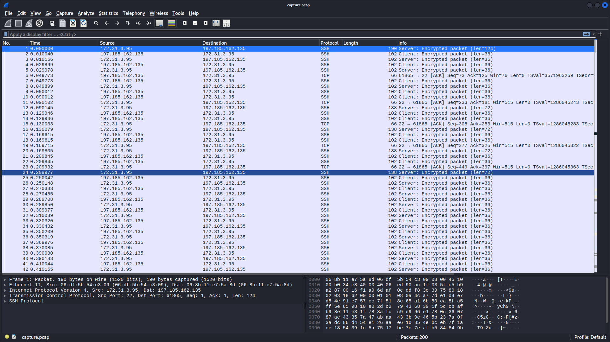

# Project 04 - PCAP Network Forensics


---

## Overview

In this project I performed live packet capture on the victim machine and on the Kali attacker machine during attack simulations, then analysed the resulting PCAP files to identify attack patterns and extract network-level indicators of compromise. I used both tcpdump for capture and Wireshark for in-depth packet analysis.

Packet capture and network forensics are core skills for any SOC analyst. The network never lies - even when attackers clear logs or use encrypted channels, the metadata visible in network traffic often reveals what happened.

---

## MITRE ATT&CK Mapping

| Field | Value |
|-------|-------|
| Tactic | Discovery / Collection |
| Technique | Network Sniffing |
| ID | T1040 |
| Data Source | Network traffic, PCAP files |

---

## Lab Environment

| Component | Details |
|-----------|---------|
| Victim OS | Ubuntu 24.04 (AWS EC2, af-south-1) |
| Attacker | Kali Linux |
| Capture Tool | tcpdump 4.x |
| Analysis Tool | Wireshark 4.x |
| Capture Interface | eth0 (victim), eth0 (Kali) |

---

## Capture Setup

### Capturing on the Victim Machine

I ran tcpdump on the victim's primary network interface to capture all inbound and outbound traffic during the attack simulation:

```bash
# Capture all traffic on eth0 and write to file
sudo tcpdump -i eth0 -w /tmp/capture.pcap

# In a separate terminal, run the attack from Kali, then Ctrl+C to stop capture
```

**Targeted capture - only SSH traffic:**

```bash
sudo tcpdump -i eth0 -w /tmp/ssh-capture.pcap port 22
```

**Targeted capture - filter by attacker IP:**

```bash
sudo tcpdump -i eth0 -w /tmp/attack-capture.pcap host 197.185.162.135
```

### Capturing on the Kali Attacker Machine

```bash
# Capture Nmap scan traffic
sudo tcpdump -i eth0 -w /tmp/nmap-scan.pcap

# In another terminal
nmap -sV -sS 13.246.220.248

# Stop capture with Ctrl+C
```

---

## Analysis 1 - Brute Force Attack Pattern

After loading the brute force capture into Wireshark, I filtered for SSH traffic:

```
tcp.port == 22
```

**What I observed:**

- Rapid sequential TCP SYN packets from 197.185.162.135 to 13.246.220.248 on port 22
- Each connection followed the pattern: SYN, SYN-ACK, ACK (connection established), then data exchange, then RST/FIN
- The cycle repeated dozens of times within seconds - this is the Hydra connection-per-attempt pattern
- Time delta between connections was under 1 second, which is abnormal for human interactive SSH sessions

**Wireshark filter for brute force pattern:**

```
ip.src == 197.185.162.135 && tcp.port == 22 && tcp.flags.syn == 1
```

**Statistics used:**

- Conversations (Statistics > Conversations > TCP tab) showed 36 individual TCP sessions from the attacker IP, all on port 22, all within a 2-minute window.

---

## Analysis 2 - Nmap Scan Pattern

After loading the Nmap capture, I applied the following Wireshark filter:

```
tcp.flags.syn == 1 && tcp.flags.ack == 0
```

This shows only the outgoing SYN packets from the scanner, which is the clearest view of the port scan.

**What I observed:**

- Sequential SYN packets to destination ports 1, 2, 3, ..., 1000+ sent in rapid succession
- Ports that were closed responded with TCP RST
- Port 22 responded with SYN-ACK (open)
- All packets originated from the same source IP and source port range

**Timeline analysis (Statistics > IO Graph):**

The IO graph showed a massive spike in packet rate for approximately 15-20 seconds, perfectly consistent with an automated Nmap scan. Normal human network traffic does not produce this pattern.

---

## Analysis 3 - Identifying Cleartext Credentials

In environments using non-encrypted protocols, tcpdump can capture credentials in transit. I demonstrated this with a simulated HTTP basic authentication request:

```bash
# On victim - start a basic HTTP service
python3 -m http.server 8080

# On Kali - send authenticated request
curl -u admin:password123 http://13.246.220.248:8080/
```

**Wireshark filter to find credentials:**

```
http.authorization
```

This highlights packets containing HTTP Authorization headers, which may contain base64-encoded credentials that can be decoded trivially.

**Command-line extraction with tshark:**

```bash
tshark -r /tmp/capture.pcap -Y "http.authorization" -T fields -e http.authorization
```

---

## Key Forensic Indicators

| Attack | Network Indicator | How to Detect |
|--------|------------------|--------------|
| SSH brute force | Many TCP sessions to port 22 from one IP in seconds | Conversations stats, IO graph spike |
| Nmap SYN scan | Sequential SYN to many ports, RST back | tcp.flags.syn==1 filter, port scan pattern |
| Nmap version scan | Full TCP handshake then service banner exchange | tcp.flags.syn==1 && tcp.flags.ack==1 |
| Data exfiltration | Large outbound data transfer | Statistics > Endpoints, byte count |

---

## tshark Command Reference

```bash
# Read a pcap and display as text
tshark -r capture.pcap

# Filter for specific IP
tshark -r capture.pcap -Y "ip.addr == 197.185.162.135"

# Extract all unique destination ports contacted (scan detection)
tshark -r capture.pcap -T fields -e tcp.dstport | sort -u | wc -l

# Count connections per source IP
tshark -r capture.pcap -T fields -e ip.src | sort | uniq -c | sort -rn

# Extract HTTP hosts visited
tshark -r capture.pcap -Y http -T fields -e http.host | sort -u
```

---

## Splunk Integration

PCAP analysis findings can be fed into Splunk in two ways:

1. **Zeek (formerly Bro)** - Zeek processes PCAPs and produces structured JSON logs that Splunk can ingest. This gives you conn.log, http.log, dns.log, and many others.
2. **Suricata** - Suricata can run IDS rules against a PCAP file and generate alerts that Splunk can ingest.

```bash
# Process a PCAP with Zeek
zeek -r capture.pcap
# Produces conn.log, http.log, dns.log, etc.
```

---

## Response Actions

1. Preserve the PCAP as evidence - copy to secure, read-only storage with checksums.
2. Extract all unique source IPs, destination IPs, and domains from the capture.
3. Cross-reference IPs and domains with threat intelligence.
4. Identify the attack timeline from packet timestamps - this is the authoritative source of truth.
5. Check for any data leaving the network to unexpected destinations (data exfiltration).
6. Feed IOCs (IPs, domains) into Splunk lookups for ongoing monitoring.

---

## Key Takeaways

- tcpdump is available on almost every Linux system and requires no setup - it should be the first tool used to capture evidence before anything is cleared.
- Wireshark's conversation and IO graph statistics make it very fast to spot anomalous traffic patterns without reading individual packets.
- A SYN scan leaves a very distinct fingerprint: hundreds of SYN packets to sequential ports within seconds, from a single source IP.
- Network forensics provides evidence that cannot be tampered with after the fact (unlike log files on the compromised host), making PCAP a critical component of any incident investigation.

---

## Screenshots

### 1. tcpdump Live Capture on the Victim

tcpdump running on the victim's ens5 interface and writing to /tmp/capture.pcap. The output confirms 200 packets captured, 221 received by filter, and 0 dropped by the kernel - a clean capture with no data loss.



---

### 2. Wireshark Conversations - Attacker to Victim Traffic Summary

The Conversations table summarises the entire captured session: 172.31.3.95 (victim) to 197.185.162.135 (attacker), 114 total packets, 12 kB exchanged in 1.13 seconds. This duration and packet volume for a single TCP conversation is the unmistakable fingerprint of an automated attack tool.



---

### 3. Wireshark Raw Packet List - SSH Attack Stream

The raw packet view shows the individual TCP frames making up the attack session. The sequence of SSHv2 encrypted packets alternating between client and server confirms the brute force tool was completing full TCP handshakes before each authentication attempt.



---

## Files

- [../../scripts/brute-force-simulation.sh](../../scripts/brute-force-simulation.sh) - Attack simulation script that generates the captured traffic
