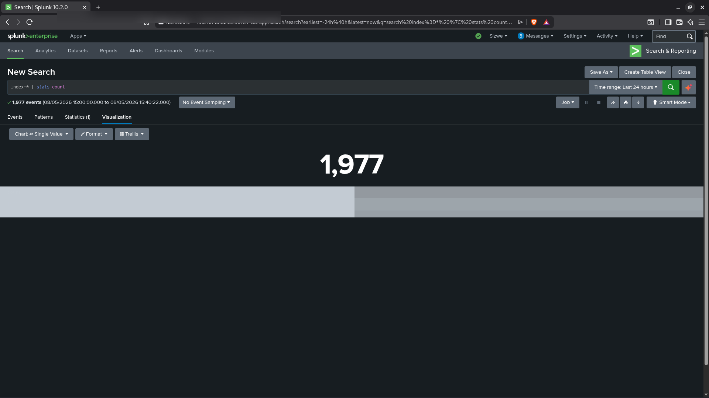
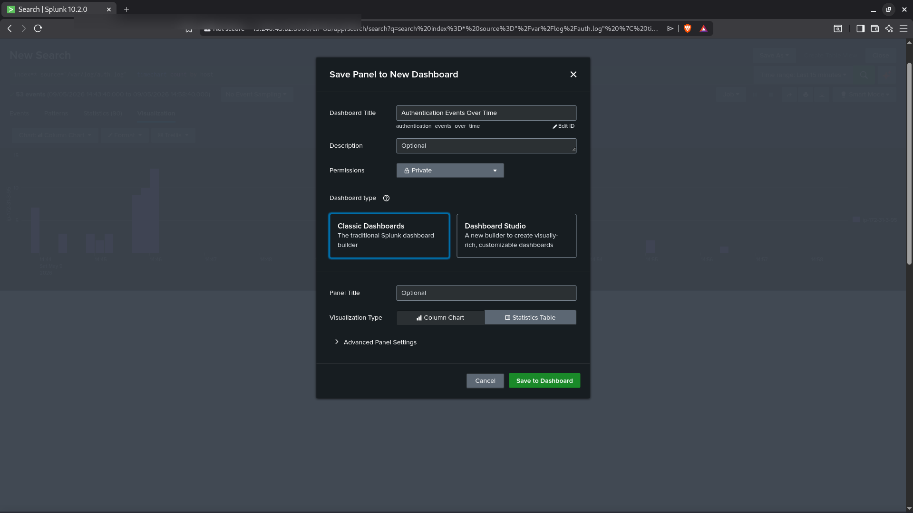
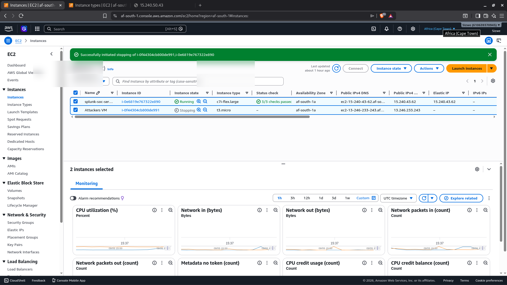

# Project 06 - SOC Dashboard in Splunk


---

## Overview

In this project I built a SOC monitoring dashboard in Splunk Enterprise that provides a single-pane-of-glass view of all security events from the lab environment. The dashboard consolidates authentication failures, persistence events, privilege escalation attempts, and general log volume into a set of panels that a SOC analyst can use to monitor the environment in real time.

A well-designed dashboard is the difference between an analyst who spots an attack in minutes and one who misses it entirely. This project demonstrates my ability to translate detection logic into actionable visualisations.

---

## Lab Environment

| Component | Details |
|-----------|---------|
| SIEM | Splunk Enterprise 10.2.0 |
| Dashboard URL | http://15.240.43.62:8000 |
| Data Sources | /var/log/auth.log, /var/log/audit/audit.log |
| Victim Host | ip-172-31-3-95 |
| Refresh Rate | Every 30 seconds |

---

## Dashboard Panels

### Panel 1 - Total Events (Last 24 Hours)

**Purpose:** High-level indicator of overall log volume. A sudden spike or drop from baseline is the first sign something is wrong.

```spl
index=* host="ip-172-31-3-95"
| stats count as total_events
```

**Visualisation type:** Single value with sparkline trend.

---

### Panel 2 - Failed SSH Logins Over Time

**Purpose:** Detect brute force and credential spraying attacks in real time. The timeline makes it easy to see burst patterns.

```spl
index=* source="/var/log/auth.log" "Failed password"
| timechart span=1m count as failed_logins
```

**Visualisation type:** Line chart, 1-minute buckets.

**Alert threshold:** More than 10 failed logins in any 1-minute bucket.

---

### Panel 3 - Top Source IPs by Failed Login Count

**Purpose:** Identify which IPs are responsible for the most authentication failures. This surfaces active brute force sources.

```spl
index=* source="/var/log/auth.log" "Failed password"
| rex "from (?P<src_ip>\d+\.\d+\.\d+\.\d+)"
| stats count by src_ip
| sort -count
| head 10
```

**Visualisation type:** Bar chart, top 10 source IPs.

---

### Panel 4 - Successful SSH Logins

**Purpose:** Track legitimate access and detect any authorised logins following a brute force attack, which may indicate successful credential compromise.

```spl
index=* source="/var/log/auth.log" "Accepted"
| rex "from (?P<src_ip>\d+\.\d+\.\d+\.\d+)"
| rex "for (?P<username>\w+)"
| table _time, src_ip, username
| sort -_time
```

**Visualisation type:** Table with timestamp, source IP, and username.

---

### Panel 5 - Persistence Events

**Purpose:** Real-time visibility into cron modifications, file writes to sensitive locations, and scheduled task changes.

```spl
index=* source="/var/log/audit/audit.log" key="persistence"
| rex "comm=\"(?P<command>[^\"]+)\""
| table _time, host, command
| sort -_time
```

**Visualisation type:** Table with colour-coded severity.

---

### Panel 6 - User Account Modifications

**Purpose:** Detect account creation, modification, or deletion that could indicate an attacker establishing a backdoor user.

```spl
index=* source="/var/log/audit/audit.log" key="user_modification"
| rex "comm=\"(?P<command>[^\"]+)\""
| rex "auid=(?P<auid>\d+)"
| table _time, host, command, auid
| sort -_time
```

**Visualisation type:** Table.

---

### Panel 7 - Privilege Escalation Attempts

**Purpose:** Surface all sudo usage and privilege escalation attempts for review.

```spl
index=* source="/var/log/audit/audit.log" key="privilege_escalation"
| rex "auid=(?P<auid>\d+)"
| rex "comm=\"(?P<command>[^\"]+)\""
| stats count by host, auid, command
| sort -count
```

**Visualisation type:** Bar chart by user.

---

### Panel 8 - Event Volume by Log Source

**Purpose:** Ensure all log sources are actively sending data. A log source that goes silent may indicate tampering or a Splunk Forwarder issue.

```spl
index=* host="ip-172-31-3-95"
| stats count by source
| sort -count
```

**Visualisation type:** Pie chart.

---

## Full Dashboard XML

To import this dashboard directly into Splunk, navigate to Dashboards > Create New Dashboard > Edit Source and paste the following XML:

```xml
<dashboard>
  <label>SOC Lab - Security Overview</label>
  <row>
    <panel>
      <title>Failed SSH Logins - Last 24 Hours</title>
      <chart>
        <search>
          <query>index=* source="/var/log/auth.log" "Failed password" | timechart span=5m count</query>
          <earliest>-24h</earliest>
          <latest>now</latest>
        </search>
        <option name="charting.chart">line</option>
        <option name="refresh.time.visible">true</option>
      </chart>
    </panel>
    <panel>
      <title>Top Attacking IPs</title>
      <chart>
        <search>
          <query>index=* source="/var/log/auth.log" "Failed password" | rex "from (?P&lt;src_ip&gt;\d+\.\d+\.\d+\.\d+)" | stats count by src_ip | sort -count | head 10</query>
          <earliest>-24h</earliest>
          <latest>now</latest>
        </search>
        <option name="charting.chart">bar</option>
      </chart>
    </panel>
  </row>
  <row>
    <panel>
      <title>Persistence Events</title>
      <table>
        <search>
          <query>index=* source="/var/log/audit/audit.log" key="persistence" | rex "comm=\"(?P&lt;command&gt;[^\"]+)\"" | table _time, host, command | sort -_time</query>
          <earliest>-24h</earliest>
          <latest>now</latest>
        </search>
      </table>
    </panel>
    <panel>
      <title>User Account Changes</title>
      <table>
        <search>
          <query>index=* source="/var/log/audit/audit.log" key="user_modification" | rex "comm=\"(?P&lt;command&gt;[^\"]+)\"" | table _time, host, command | sort -_time</query>
          <earliest>-24h</earliest>
          <latest>now</latest>
        </search>
      </table>
    </panel>
  </row>
</dashboard>
```

---

## Dashboard Design Principles

When I designed this dashboard I followed these SOC monitoring best practices:

1. **Most urgent information at the top.** Active brute force (Panel 2) and attacking IPs (Panel 3) are in the first row because they require the fastest response.

2. **Timeline charts for anomaly detection.** Spikes are immediately visible on a timechart even without knowing the baseline.

3. **Tables for post-attack investigation.** Once an anomaly is spotted, the analyst needs the raw events in a table to understand exactly what happened.

4. **Monitor the monitors.** Panel 8 (log source health) ensures the detection pipeline itself is functioning.

5. **Short time ranges for operations.** Most panels default to the last 15-60 minutes for real-time monitoring. Longer ranges (24h, 7d) are used for trending.

---

## Key Takeaways

- A Splunk dashboard is only as good as the data being ingested. Setting up the Splunk Universal Forwarder and auditd correctly is what makes meaningful dashboards possible.
- Saving detection queries as dashboard panels rather than just running them ad-hoc means any analyst on shift can see the current security posture immediately.
- Colour coding (red for high severity, yellow for medium) makes it faster to triage panels during high-pressure incidents.
- This dashboard can be extended to include additional data sources such as AWS CloudTrail, VPC Flow Logs, or DNS logs as the lab grows.

---

## Screenshots

### 1. Splunk - Total Event Count (1,977 Events in 24 Hours)

The single-value visualisation shows 1,977 events ingested across all log sources in the previous 24 hours. This is the SOC dashboard health check panel - it confirms the data pipeline is active and establishes the daily event baseline.



---

### 2. Save Panel to New Dashboard - Authentication Events Over Time

Saving a timechart panel to a new Splunk dashboard titled "Authentication Events Over Time". This is how each detection query gets promoted from a one-off search into a persistent monitoring panel visible to every analyst on shift.



---

### 3. AWS EC2 - Both Lab Instances Running (af-south-1)

The AWS console showing both EC2 instances in the Africa Cape Town region: the Splunk server and the Ubuntu 24.04 victim machine. Instance IDs and public IPs have been redacted. Both instances show a healthy status check.


